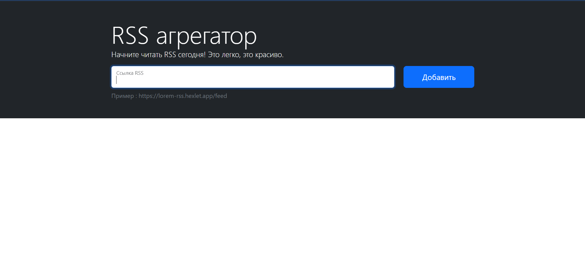

### Hexlet tests and linter status:

# RSS-reader
## Описание проекта:
Сервис для агрегации RSS-потоков
## Stack
- JS
- axios
- i18next
- Webpack
- Yup 
## Live Demo:
https://frontend-project-11-eight-theta.vercel.app/

